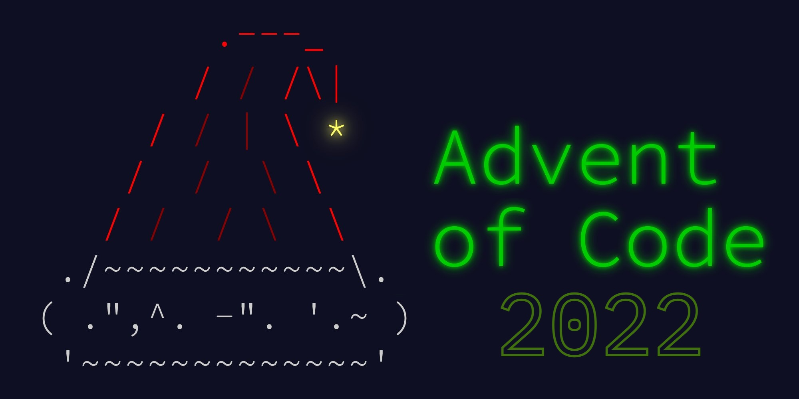

# Advent of Code '22

   [](https://github.com/nryabykh/aoc2022/actions/workflows/main.yml)

[](https://aoc2022-nriabykh.streamlit.app/)




My solutions of [Advent of Code 2022](https://adventofcode.com/2022).

- Inputs: `./input`
- Code: `./solutions`

```bash
usage: main.py [-h] [-d DAY] [-t]

options:
  -h, --help         show this help message and exit
  -d DAY, --day DAY  Number of day (from 1 to 25)
  -t, --test         Use test data

example: python3 main.py -d 6 -t
```

Or run Streamlit app which represents answers and solutions without explicit run:
```
chmod +x start.sh
./start.sh

or

. venv/bin/activate
streamlit run streamlit_app.py
```