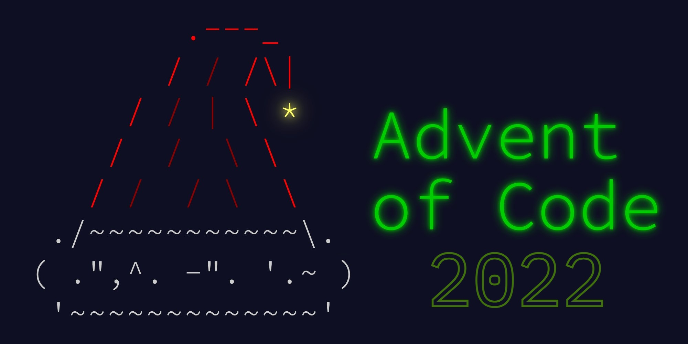

# Advent of Code '22

  




My solutions of [Advent of Code 2022](https://adventofcode.com/2022).

- Inputs: `./input`
- Code: `./solutions`

#### Usage
```bash
main.py [-h] [-d DAY] [-t]


python3 main.py -d 1 -t
python3 main.py --day 2
```
